### 0. 说明

来源： [RabbitMQ - YouTube](https://www.youtube.com/watch?v=iQ4kENLfaNI&list=PLqQobDgJHSdPV-E15ocgpOLGreYgwcZUj&index=3&t=50s)

### 1. 配置环境

在 windows 系统和 linux 系统中使用 docker 来配置环境比较方便。

```bash
docker run -d --name my-rabbitmq -p 5672:5672 -p 15672:15672 rabbitmq:3-management
```

5672 为 rabbitmq 的默认端口， 15672 为 rabbitmq 插件的默认端口。

然后浏览器访问 http://localhost:15672 就可以进行登录。默认的用户名：guest  默认的密码：guest


### 2. 基础知识

#### 2.1 核心概念

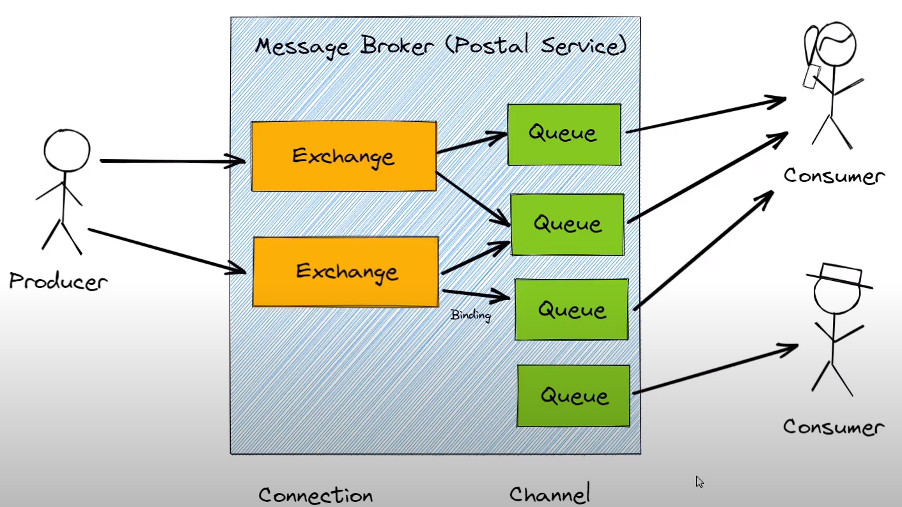


RabbitMQ 是一款开源的消息队列软件，用于在分布式应用程序之间传递消息。以下是 RabbitMQ 中一些核心概念的介绍：

1. 生产者 (Producer)：
   生产者是消息队列中的发送方。它们负责创建并发送消息到 RabbitMQ 交换机 (Exchange) 或队列 (Queue) 中。生产者通常是应用程序的一部分，将数据发送到消息队列以供其他消费者使用。

2. 交换机 (Exchange)：
   交换机是消息的分发中心。它接收从生产者发送的消息，并将其路由到一个或多个队列中。RabbitMQ 提供不同类型的交换机，如直连交换机、主题交换机和扇出交换机，每种类型都使用不同的路由规则来决定消息的传递方式。

3. 队列 (Queue)：
   队列是消息在 RabbitMQ 中的存储区域。它们是消息的最终目的地，消费者从队列中接收消息。每个队列都有一个名称，生产者将消息发送到队列，并消费者从队列中接收消息。

4. 消费者 (Consumer)：
   消费者是消息队列中的接收方。它们订阅队列并等待接收消息。一旦消息到达队列，RabbitMQ 将消息发送给一个或多个消费者，这些消费者处理消息的内容。消费者通常是应用程序的一部分，用于执行特定的任务或处理接收到的数据。

5. 连接 (Connection)：
   连接是生产者和消费者与 RabbitMQ 服务器之间的网络连接。它代表了一个 TCP 连接，通常由应用程序初始化。连接负责建立和维护与 RabbitMQ 服务器的通信。

6. 通道 (Channel)：
   通道是连接内的虚拟通信路径。一个连接可以包含多个通道，通道之间相互隔离，但共享相同的连接。通道用于在连接上进行消息发布、订阅和确认等操作，以便更有效地利用连接。

总的来说，RabbitMQ 是一个用于消息传递的强大工具，它允许不同的应用程序之间通过消息队列进行通信。生产者将消息发送到交换机，交换机根据规则将消息路由到队列，然后消费者从队列中接收并处理消息。连接和通道用于管理与 RabbitMQ 服务器的通信，确保可靠的消息传递。这些核心概念帮助构建灵活且高效的分布式应用程序。

> <font color='orange'>一个连接可以包含多个通道，一个通道可以声明多个交换器，一个交换器可以将消息路由到一个或多个队列中。这种层次结构允许您在RabbitMQ中组织和管理消息传递，以满足不同的应用场景和需求。</font>

#### 2.2 消息通信方式

RabbitMQ是一个功能强大的消息代理，支持多种消息通信模式，以满足不同的应用场景和需求。以下是一些常见的RabbitMQ消息通信模式的介绍：

1. **点对点模式（Point-to-Point）**：
   - **工作队列模式（Work Queues）**：多个消费者共享一个队列，每个消息只能被其中一个消费者处理。这种模式用于任务分发和负载均衡。
   - **直连模式（Direct Exchange）**：消息直接发送到一个队列，消费者竞争获取消息。每个消息只会被一个消费者处理。这种模式用于点对点通信。

2. **发布-订阅模式（Publish-Subscribe）**：
   - **广播模式（Fanout Exchange）**：消息发送到一个交换机，然后由交换机广播给所有与之绑定的队列。每个队列都会收到相同的消息，用于消息广播给多个消费者。

3. **路由模式（Routing）**：
   - **主题模式（Topic Exchange）**：消息的路由键与主题模式匹配，允许更灵活的消息路由，支持通配符匹配。
   - **直连模式（Direct Exchange）**：消息的路由键与队列绑定的路由键完全匹配，用于精确的消息路由。

4. **请求-响应模式（Request-Reply）**：
   - 客户端发送请求消息，服务器处理请求并返回响应消息。通常使用回调队列来实现。

5. **发布-确认模式（Publish-Confirm）**：生产者发送消息后，可以等待代理确认消息已经被接收。这有助于确保消息的可靠性传递。

6. **消息过滤模式（Header Exchange）**：消息的路由是基于消息头的键值对进行匹配，允许根据消息属性进行消息过滤。

7. **死信队列模式（Dead Letter Queue）**：消息未能被消费或处理时，可以被重新发送到另一个队列，以后再进行处理。

8. **持久化模式（Message Durability）**：消息和队列可以被声明为持久的，以确保消息在代理重启后仍然可用。

每种通信模式都有其自己的应用场景和优点。选择适合您需求的模式是根据您的具体应用和消息通信目标来确定的。RabbitMQ的灵活性和强大的功能使其成为处理不同通信需求的理想选择。


### 3. 生产者和消费者

下面是一个简单实现生产者和消费者的案例。

==produce.py==

```python
# 导入 pika 模块，这是一个 RabbitMQ 客户端库
import pika

# 定义连接参数，连接到本地 RabbitMQ 服务器
connection_parameters = pika.ConnectionParameters('localhost')

# 创建一个连接对象，使用定义的连接参数
connection = pika.BlockingConnection(connection_parameters)

# 创建一个通道对象，通过连接与 RabbitMQ 服务器通信
channel = connection.channel()

# 声明一个队列，名为 'letterbox'，确保队列存在
channel.queue_declare(queue='letterbox')

# 准备要发送的消息内容
message = "Hello this is my first message"

# 使用通道发送消息，将消息发布到 'letterbox' 队列
channel.basic_publish(exchange='', routing_key='letterbox', body=message)

# 打印发送的消息内容
print(f"sent message: {message}")

# 关闭连接，释放资源
connection.close()
```


> `channel.basic_publish(exchange='', routing_key='letterbox', body=message)` 说明：
>
> exchange='' 这是指定消息要发送到的交换器的名称。在这里，将交换器名称设置为空字符串（''），表示消息将被直接发送到指定的队列（"letterbox"队列），而不会经过交换器的中转。这种方式被称为直接发送（direct publish）。默认使用的是一个直连交换机（见第6节）。

在RabbitMQ中，一个channel代表了一个与消息代理的连接中的独立通信通道，而不是与单个交换机绑定的通道。您可以在同一个channel上声明多个交换机，并使用它们来发送和接收消息。


==consumer.py==

```python
# 导入 pika 模块，这是一个 RabbitMQ 客户端库
import pika

# 定义一个消息接收回调函数，当有消息到达时会被调用
def on_message_received(ch, method, properties, body):
    print(f"received new message: {body}")

# 定义连接参数，连接到本地 RabbitMQ 服务器
connection_parameters = pika.ConnectionParameters('localhost')

# 创建一个阻塞连接对象，使用定义的连接参数
connection = pika.BlockingConnection(connection_parameters)

# 创建一个通道对象，通过连接与 RabbitMQ 服务器通信
channel = connection.channel()

# 声明一个队列，名为 'letterbox'，确保队列存在
channel.queue_declare(queue='letterbox')

# 设置消息消费回调函数，当从 'letterbox' 队列接收到消息时会调用上面定义的 on_message_received 函数
channel.basic_consume(queue='letterbox', auto_ack=True,
    on_message_callback=on_message_received)

# 打印消息消费开始的提示
print("Starting Consuming")

# 启动消费者，开始监听 'letterbox' 队列中的消息，并调用回调函数处理消息
channel.start_consuming()
```


> 下面详细介绍下 `channel.basic_consume(queue='letterbox', auto_ack=True, on_message_callback=on_message_received)` 这行代码。
>
> - `queue='letterbox'`：指定要消费的队列的名称。在这个例子中，消费者将从名为 'letterbox' 的队列中获取消息。
> - `auto_ack=True`：这是一个布尔值参数，表示是否启用自动确认模式。当 `auto_ack` 设置为 `True` 时，表示一旦消息被消费者接收，RabbitMQ 就会自动确认（ACK）消息，即告诉服务器消息已经成功处理。如果设置为 `False`，则需要消费者手动确认消息，以确保消息已经被处理。
> - `on_message_callback=on_message_received`：这是一个回调函数，当消费者从队列中接收到消息时将被调用。在这个例子中，回调函数是 `on_message_received`，它是一个用户定义的函数，用于处理接收到的消息。一旦消息到达，`on_message_received` 函数将被调用并传递消息的内容，以便消费者可以执行相应的处理操作。
>
> 下面详细介绍下 `on_message_received` 这个回调函数。
>
> 回调函数中的参数形参名字我们可以自己取，传入的实参是规定好的。
>
> 
>
> 1. `ch`（通道对象）：这是一个表示通道（channel）的对象，它允许您与 RabbitMQ 服务器进行通信。您可以使用通道对象来执行各种操作，例如确认消息，拒绝消息等。
> 2. `method`（方法帧）：这个参数包含了与消息相关的方法信息，例如交付标签（delivery tag）、交付标志（delivery flags）、交换机名称、路由键等。您可以使用这些信息来了解有关消息的详细信息。
> 3. `properties`（消息属性）：这个参数包含了与消息关联的属性，例如消息的头部属性、消息类型、消息ID等。消息属性可以提供关于消息的元数据信息。
> 4. `body`（消息体）：这个参数包含了消息的实际内容，即要处理的消息的主体。这通常是一个字符串，包含了消息的有效载荷。


### 4. 竞争型消费模式

#### 4.1 介绍

竞争型消费者模式（Competing Consumer Pattern），有时也称为工作队列（Work Queue）模式，是一种用于处理任务的消息传递模式，通常用于分布式系统中。这个模式允许多个消费者（工作者）并发地从一个共享队列中获取并处理任务。

以下是 RabbitMQ 中的竞争型消费者模式的工作原理和关键概念：

1. **生产者**：生产者负责将任务（消息）发送到共享队列中。这些任务可以是需要异步处理的工作，如图像处理、数据分析、报表生成等。

2. **队列**：队列是任务的缓冲区，生产者将任务放入队列，等待消费者来处理。多个消费者可以同时从同一个队列中获取任务。

3. **消费者（工作者）**：消费者是处理任务的进程或应用程序。它们从队列中获取任务，执行任务的具体工作，然后将结果返回或进行其他操作。多个消费者可以同时竞争获取任务。

4. **竞争**：在竞争型消费者模式中，多个消费者同时尝试获取队列中的任务。RabbitMQ 确保每个任务只会被一个消费者处理，这意味着任务不会被重复执行。

5. **负载均衡**：竞争型消费者模式提供了一种负载均衡的机制，当有多个消费者时，任务会均匀地分配给各个消费者，以确保系统的资源充分利用。

6. **自动确认**：通常情况下，一旦消费者成功处理了一个任务，它会向 RabbitMQ 发送确认（ACK）以告知消息已经处理。RabbitMQ 将从队列中删除已确认的消息。

7. **消息持久化**：为了防止任务丢失，消息可以被标记为持久化，这意味着即使 RabbitMQ 服务器崩溃，消息也不会丢失。

竞争型消费者模式适用于需要处理大量异步任务的情况，允许多个消费者协同工作以提高系统的处理能力和可伸缩性。它还提供了一种容错机制，因为即使其中一个消费者失败，其他消费者仍然可以继续处理队列中的任务。

在 RabbitMQ 中，这种模式的实现非常简单，通过创建共享队列并启动多个消费者进程即可。每个消费者进程将竞争获取队列中的任务，然后执行它们。这种模式是构建可靠的任务处理系统的重要组成部分，特别是在需要处理高并发任务的情况下。

#### 4.2 代码

==produce.py==

```python
import pika
import time
import random

connection_parameters = pika.ConnectionParameters('localhost')

connection = pika.BlockingConnection(connection_parameters)

channel = connection.channel()

channel.queue_declare(queue='letterbox')

messageId = 1

while(True):
    message = f"Sending messageId: {messageId} at {time.time()}"

    channel.basic_publish(exchange='', routing_key='letterbox', body=message)

    print(f"sent message: {message}")
    
    time.sleep(random.randint(1, 4))

    messageId += 1

```


==consumer.py==

```python
import pika
import time
import random


def on_message_received(ch, method, properties, body):
    processing_time = random.randint(1, 6)
    print(f"received: {body}, will take {processing_time} to process")
    time.sleep(processing_time)
    ch.basic_ack(delivery_tag=method.delivery_tag)
    print(f"Finished processing the message")

connection_parameters = pika.ConnectionParameters('localhost')

connection = pika.BlockingConnection(connection_parameters)

channel = connection.channel()

channel.queue_declare(queue='letterbox')

channel.basic_qos(prefetch_count=1)

channel.basic_consume(queue='letterbox', on_message_callback=on_message_received)

print("Starting Consuming")

channel.start_consuming()
```

要启动多个 consumer.py 才会产生竞争。


> 下面对代码中的两行代码进行说明。
>
> 1. `channel.basic_qos(prefetch_count=1)`:
>
>    这行代码的作用是设置消费者的 QoS（Quality of Service）。QoS 定义了消费者如何处理消息的顺序和数量。在这里，`prefetch_count=1` 表示每次只允许消费者获取并处理一个消息，然后再获取下一个。这个设置可以确保公平分发消息给多个消费者，防止某个消费者长时间占用队列，导致其他消费者无法获得任务。这是一种常见的设置，特别是在多个消费者同时处理任务的情况下，以实现负载均衡。
>
>    <font color='orange'>这是最关键的一行代码。每个消费者都能够立即获取并处理消息，而不必等待其他消费者完成。</font>这可以提高系统的并发性，允许多个消费者并行处理消息。如果注释掉，那么就会出现以下的情况：
>
>    1. 消费者会依次获取队列中的消息，每个消息只会被一个消费者处理。
>    2. 当有多个消费者时，它们会轮流获取消息，确保每个消费者都有机会处理任务。
>    3. 如果一个消费者正在处理消息，其他消费者会等待直到当前消费者处理完成，然后才能继续获取下一个消息。
>
>    
>
> 2. `ch.basic_ack(delivery_tag=method.delivery_tag)`:
>
>    这行代码的作用是手动确认消息的处理。在消费者成功处理完一条消息后，通常需要通知 RabbitMQ 这个消息已经处理，可以从队列中移除。`ch.basic_ack(delivery_tag=method.delivery_tag)` 执行了手动确认操作，其中：
>
>    - `ch` 是消费者的通道对象。
>    - `basic_ack` 是用于消息确认的方法。
>    - `delivery_tag` 是消息的唯一标识符，它可以确保正确地确认特定的消息。
>
>    手动确认消息是一种重要的做法，可以确保消息在处理期间不会丢失。如果消费者在处理消息期间发生了错误，并且没有确认消息，RabbitMQ 将认为消息没有被成功处理，然后重新将其放回队列以供其他消费者处理。这确保了消息不会因消费者的故障而丢失。


### 5. Fanout Exchange

#### 5.1 介绍

扇出交换机（Fanout Exchange）是 RabbitMQ 中一种常见的交换机类型，它的主要特点是将接收到的消息广播到与之绑定的所有队列，无论队列的数量多少，每个队列都会收到一份相同的消息副本。扇出交换机的工作方式类似于广播，适用于需要一条消息被多个消费者同时处理的情况。

以下是扇出交换机的主要特点和用途：

1. **广播消息**：扇出交换机将每一条发送到它的消息广播给与之绑定的所有队列，不关心队列的数量。这确保了每个队列都可以独立地处理相同的消息。

2. **发布/订阅模式**：扇出交换机常用于发布/订阅模式，其中发布者（生产者）将消息发送到扇出交换机，而多个订阅者（消费者）可以绑定到不同的队列，并接收相同的消息内容，以便并行处理或分发。

3. **无需关心消息路由键**：扇出交换机不考虑消息的 routing key，因此无论消息的 routing key 是什么，消息都会被广播到所有与之绑定的队列。

4. **简单配置**：扇出交换机的配置非常简单，因为它只负责广播消息，无需复杂的路由规则。

使用扇出交换机的步骤通常包括：

1. 创建一个扇出交换机。

2. 创建多个队列，并将它们绑定到扇出交换机上。

3. 生产者将消息发送到扇出交换机。

4. 消费者分别从队列中获取并处理消息。

扇出交换机适用于需要广播消息给多个消费者或订阅者的场景，例如日志记录、通知、事件处理等。在这些情况下，多个消费者可以同时监听并独立处理相同的消息，提高了系统的可扩展性和并发性。

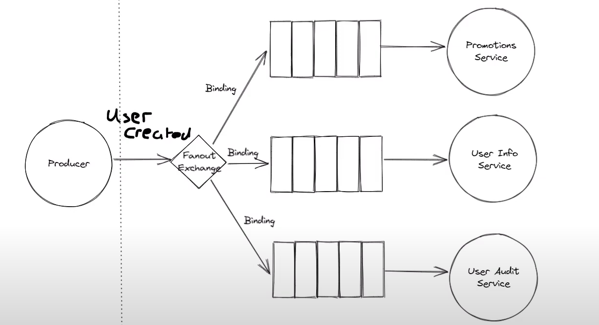

#### 5.2 代码

==produce.py==

```python
import pika
from pika.exchange_type import ExchangeType

connection_parameters = pika.ConnectionParameters(host="localhost")

connection = pika.BlockingConnection(connection_parameters)

channel = connection.channel()

channel.exchange_declare(exchange="pubsub", exchange_type=ExchangeType.fanout)

message = "Hello I want to broadcast this message to all the subscribers"

channel.basic_publish(exchange="pubsub", routing_key="", body=message)

print(f"sent message: {message}")

connection.close()

```


> 下面介绍下 `channel.exchange_declare(exchange="pubsub", exchange_type=ExchangeType.fanout)`
>
> 声明了名为"pubsub"的交换器，并将其类型设置为"fanout"。如果交换器在之前已经被声明，再次声明它不会导致错误或其他不良影响，但也不会有任何实际的效果。


==firstconsumer.py==

```python
import pika

def on_message_received(ch, method, properties, body):
    print(f"firstconsumer - received new message: {body}")

connection_parameters = pika.ConnectionParameters('localhost')

connection = pika.BlockingConnection(connection_parameters)

channel = connection.channel()

channel.exchange_declare(exchange='pubsub', exchange_type='fanout')

queue = channel.queue_declare(queue='', exclusive=True)

channel.queue_bind(exchange='pubsub', queue=queue.method.queue)   # 将之前声明的队列与名为"pubsub"的交换器进行绑定（是关键） 

channel.basic_consume(queue=queue.method.queue, auto_ack=True,
    on_message_callback=on_message_received)

print("Starting Consuming")

channel.start_consuming()
```


> 下面对代码中的两行代码进行说明。
>
> 1. `queue = channel.queue_declare(queue='', exclusive=True)`: 这行代码的目的是声明一个队列。
>
>    - `queue=''`: 这是队列的名称。在这里，将队列的名称设为空字符串，这意味着RabbitMQ会自动生成一个唯一的队列名称，通常用于匿名队列（anonymous queues）。这是因为`exclusive=True`设置了为True，这将创建一个排他队列，排他队列只能由声明它的连接使用。
>
>    - `exclusive=True`: 这个参数指定了队列是否是排他的。排他队列只能由声明它的连接使用，一旦连接关闭，队列将被删除。在这里，将排他标志设置为True，表示这是一个排他队列。
>
>    这行代码的作用是创建一个临时的、唯一的队列，并将其存储在`queue`变量中，以便后续使用。
>
> 2. `channel.basic_consume(queue=queue.method.queue, auto_ack=True, on_message_callback=on_message_received)`: 这行代码用于设置消费者来从指定的队列中接收消息。
>
>    - `queue=queue.method.queue`: 这是要消费的队列的名称。在这里，我们使用之前声明的临时队列的名称，它存储在`queue`变量中。
>
>    - `auto_ack=True`: 这个参数设置为True，表示当消费者接收到消息后，消息将自动被确认（acknowledged）。这意味着一旦消息被成功处理，RabbitMQ会自动将其标记为已处理，不需要手动确认。
>
>    - `on_message_callback=on_message_received`: 这是一个回调函数，用于处理接收到的消息。在这里，当消费者接收到消息时，将调用名为`on_message_received`的函数来处理消息。这个函数通常包含您自己的业务逻辑，以处理接收到的消息。
>
>    这行代码的作用是设置一个消费者，使其从指定的队列中接收消息，并在接收到消息时调用`on_message_received`函数来处理消息。
>
> 总之，这两行代码一起用于设置一个消费者，使其从一个队列中接收消息并处理这些消息。这允许您订阅来自交换器的消息并执行相应的操作。


==secondconsumer.py==

```python
import pika

def on_message_received(ch, method, properties, body):
    print(f"secondconsumer - received new message: {body}")

connection_parameters = pika.ConnectionParameters('localhost')

connection = pika.BlockingConnection(connection_parameters)

channel = connection.channel()

channel.exchange_declare(exchange='pubsub', exchange_type='fanout')

queue = channel.queue_declare(queue='', exclusive=True)

channel.queue_bind(exchange='pubsub', queue=queue.method.queue)

channel.basic_consume(queue=queue.method.queue, auto_ack=True,
    on_message_callback=on_message_received)

print("Starting Consuming")

channel.start_consuming()
```


### 6. Direct Exchange

#### 6.1 介绍

直连交换机（Direct Exchange）是 RabbitMQ 中一种常见的交换机类型，它的主要特点是根据消息的 routing key 将消息路由到与之匹配的队列。这种交换机类型适用于点对点通信或任务分发，它会确保消息只被发送到具有匹配 routing key 的队列。

以下是直连交换机的主要特点和用途：

1. **精确路由**：直连交换机根据消息的 routing key 来进行精确的路由。只有与消息的 routing key 完全匹配的队列会接收到消息。

2. **一对一通信**：直连交换机通常用于点对点通信，其中一个生产者发送消息到一个具有特定 routing key 的队列，一个消费者接收并处理该消息。

3. **任务分发**：直连交换机也可以用于任务分发，生产者将任务发送到队列，不同的任务可以使用不同的 routing key，然后多个消费者可以监听队列并根据不同的任务类型来处理消息。

4. **多队列支持**：直连交换机可以绑定到多个队列，并根据消息的 routing key 将消息路由到匹配的队列。这使得它适用于一对多通信或任务分发。

使用直连交换机的步骤通常包括：

1. 创建一个直连交换机。

2. 创建一个或多个队列，并将它们与直连交换机绑定。每个队列通常使用一个特定的 routing key 进行绑定。

3. 生产者将消息发送到直连交换机，并指定消息的 routing key。

4. 消费者监听队列，根据队列的 routing key 来接收并处理消息。

直连交换机是一种灵活的消息路由机制，允许你根据消息的 routing key 精确地将消息发送到指定的队列。这对于需要按照不同规则路由消息的应用非常有用，因为它允许你定义自己的路由策略。

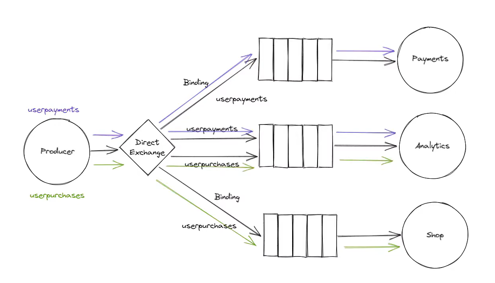

#### 6.2 代码

==producer.py==

```python
import pika
from pika.exchange_type import ExchangeType

connection = pika.BlockingConnection(pika.ConnectionParameters(host='localhost'))

channel = connection.channel()

# 声明交换机的名称为 routing，交换机的类型为 direct
channel.exchange_declare(exchange='routing', exchange_type=ExchangeType.direct)

message = 'This message needs to be routed'

# 将一条消息发布到一个名为"routing"的直连交换器中，并指定消息的路由键。
# channel.basic_publish(exchange='routing', routing_key='both', body=message)   # 这行代码与下面两行代码一样

channel.basic_publish(exchange='routing', routing_key='paymentsonly', body=message)
channel.basic_publish(exchange='routing', routing_key='analyticsonly', body=message)

print(f'sent message: {message}')

connection.close()

```


==analyticsconsumer.py==

```python
import pika
from pika.exchange_type import ExchangeType

def on_message_received(ch, method, properties, body):
    print(f'Analytics - received new message: {body}')

connection_parameters = pika.ConnectionParameters('localhost')

connection = pika.BlockingConnection(connection_parameters)

channel = connection.channel()

channel.exchange_declare(exchange='routing', exchange_type=ExchangeType.direct)

queue = channel.queue_declare(queue='', exclusive=True)

channel.queue_bind(exchange='routing', queue=queue.method.queue, routing_key='analyticsonly')
channel.queue_bind(exchange='routing', queue=queue.method.queue, routing_key='both')

channel.basic_consume(queue=queue.method.queue, auto_ack=True,
    on_message_callback=on_message_received)

print('Analytics Starting Consuming')

channel.start_consuming()
```


==paymentsconsumer.py==

```python
import pika
from pika.exchange_type import ExchangeType

def on_message_received(ch, method, properties, body):
    print(f'Payments - received new message: {body}')

connection_parameters = pika.ConnectionParameters('localhost')

connection = pika.BlockingConnection(connection_parameters)

channel = connection.channel()

channel.exchange_declare(exchange='routing', exchange_type=ExchangeType.direct)

queue = channel.queue_declare(queue='', exclusive=True)

channel.queue_bind(exchange='routing', queue=queue.method.queue, routing_key='paymentsonly')
channel.queue_bind(exchange='routing', queue=queue.method.queue, routing_key='both')

channel.basic_consume(queue=queue.method.queue, auto_ack=True,
    on_message_callback=on_message_received)

print('Payments Starting Consuming')

channel.start_consuming()

```

### 7.Topic Exchange

#### 7.1 介绍

主题交换机（Topic Exchange）是 RabbitMQ 中一种灵活而强大的交换机类型，它允许消息的路由键（routing key）与模式相匹配，从而将消息路由到一个或多个队列。主题交换机的工作方式类似于通配符，可以根据消息的路由键进行模糊匹配，使得消息能够按照复杂的条件被路由到不同的队列。

以下是主题交换机的主要特点和用途：

1. **灵活的消息路由**：主题交换机允许你定义消息的 routing key 以模式匹配的方式，而不是精确匹配。这意味着你可以使用通配符来匹配多种消息 routing key，实现更灵活的消息路由。

2. **多队列支持**：主题交换机可以绑定到多个队列，并根据消息的 routing key 将消息路由到匹配的队列。这允许你根据多个条件来路由消息，非常适用于发布/订阅模式。

3. **通配符支持**：主题交换机支持两种通配符符号："*" 表示匹配一个单词，"#" 表示匹配零个或多个单词。这使得你可以根据需要定义复杂的匹配模式。

4. **灵活的订阅模式**：主题交换机适用于多个消费者订阅不同的消息类型或条件。每个消费者可以使用自己的 routing key 来筛选感兴趣的消息。

5. **动态路由**：主题交换机允许你根据不同的消息内容动态地路由消息，而不需要修改交换机或队列的配置。

使用主题交换机的步骤通常包括：

1. 创建一个主题交换机。

2. 创建一个或多个队列，并将它们与主题交换机绑定。每个队列通常使用一个特定的 routing key 模式进行绑定。

3. 生产者将消息发送到主题交换机，并指定消息的 routing key。

4. 消费者监听队列，根据队列的 routing key 模式来接收并处理消息。

主题交换机是一种非常灵活和强大的消息路由机制，可以根据消息内容的多种条件将消息路由到不同的队列。这使得它适用于多样化的消息传递需求，包括发布/订阅、事件处理、过滤和分发等。

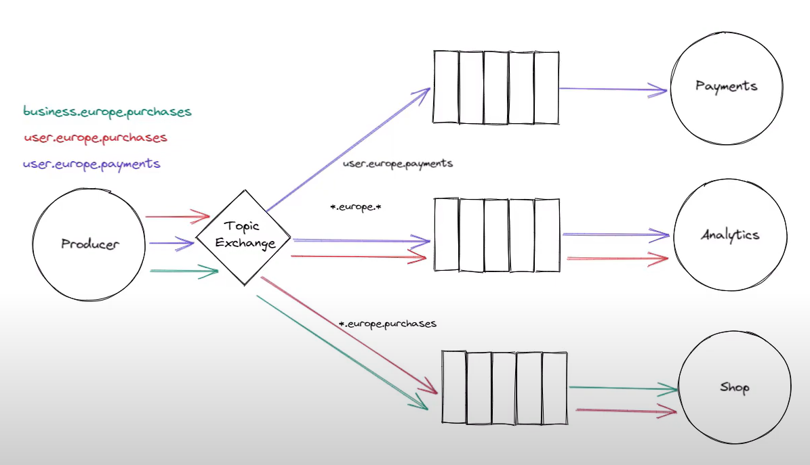

#### 7.2 代码

==producer.py==

```python
import pika
from pika.exchange_type import ExchangeType

connection_parameters = pika.ConnectionParameters(host='localhost')

connection = pika.BlockingConnection(connection_parameters)

channel = connection.channel()

channel.exchange_declare(exchange='topic', exchange_type=ExchangeType.topic)

user_payments_message = 'A europan user paid for something'

channel.basic_publish(exchange='topic', routing_key='user.europe.payments', body=user_payments_message)

print(f'sent message: {user_payments_message}')

business_order_message = 'A european business ordered goods'

channel.basic_publish(exchange='topic', routing_key='business.europe.orders', body=business_order_message)

print(f'sent message: {business_order_message}')

connection.close()
```


==analyticsconsumer.py==

```python
import pika
from pika.exchange_type import ExchangeType

def on_message_received(ch, method, properties, body):
    print(f'Analytics - received new message: {body}')

connection_parameters = pika.ConnectionParameters('localhost')

connection = pika.BlockingConnection(connection_parameters)

channel = connection.channel()

channel.exchange_declare(exchange='topic', exchange_type=ExchangeType.topic)

queue = channel.queue_declare(queue='', exclusive=True)

channel.queue_bind(exchange='topic', queue=queue.method.queue, routing_key='*.europe.*')

channel.basic_consume(queue=queue.method.queue, auto_ack=True,
    on_message_callback=on_message_received)

print('Analytics Starting Consuming')

channel.start_consuming()

```


==paymentsconsumer.py==

```python
import pika
from pika.exchange_type import ExchangeType

def on_message_received(ch, method, properties, body):
    print(f'Payments - received new message: {body}')

connection_parameters = pika.ConnectionParameters('localhost')

connection = pika.BlockingConnection(connection_parameters)

channel = connection.channel()

channel.exchange_declare(exchange='topic', exchange_type=ExchangeType.topic)

queue = channel.queue_declare(queue='', exclusive=True)

channel.queue_bind(exchange='topic', queue=queue.method.queue, routing_key='#.payments')

channel.basic_consume(queue=queue.method.queue, auto_ack=True,
    on_message_callback=on_message_received)

print('Payments Starting Consuming')

channel.start_consuming()
```


==userconsumer.py==

```python
import pika
from pika.exchange_type import ExchangeType

def on_message_received(ch, method, properties, body):
    print(f'Analytics - received new message: {body}')

connection_parameters = pika.ConnectionParameters('localhost')

connection = pika.BlockingConnection(connection_parameters)

channel = connection.channel()

channel.exchange_declare(exchange='topic', exchange_type=ExchangeType.topic)

queue = channel.queue_declare(queue='', exclusive=True)

channel.queue_bind(exchange='topic', queue=queue.method.queue, routing_key='user.#')

channel.basic_consume(queue=queue.method.queue, auto_ack=True,
    on_message_callback=on_message_received)

print('User Starting Consuming')

channel.start_consuming()
```


> `#` 和 `*` 的区别：星号只能匹配一个单词，而井号可以匹配多个单词。
>
> 例如，给定路由键"analytics.#"，它可以匹配如下的一些示例路由键：
>
> - "analytics.data"
> - "analytics.statistics"
> - "analytics.data.processing"
>
> 例如，给定路由键"analytics.*"，它可以匹配如下的一些示例路由键：
>
> - "analytics.data"
> - "analytics.statistics"
> - 但不能匹配"analytics.data.processing"，因为星号只匹配一个单词。

### 8. Header Exchange

#### 8.1 介绍

头交换机（Headers Exchange）是 RabbitMQ 中一种特殊的交换机类型，它不是根据消息的路由键（routing key）来进行消息路由，而是根据消息的头部属性（headers）来匹配和路由消息。头交换机允许发送者定义自己的标头属性，并且只有满足一组特定标头属性的消息才会被路由到匹配的队列。

以下是头交换机的主要特点和用途：

1. **基于消息头匹配**：头交换机的路由规则基于消息的头部属性，而不是路由键。消息的头部属性是键-值对，只有当消息的头部属性与绑定队列的标头属性匹配时，消息才会被路由到相应的队列。

2. **灵活的匹配条件**：头交换机允许定义复杂的匹配条件，可以包含多个标头属性和对应的值，以及逻辑操作符（如AND和OR），从而实现更精确的消息路由。

3. **高度定制化**：发送者可以自定义消息的标头属性，用于描述消息的特性、类型或其他信息。消费者可以根据这些标头属性来选择性地接收和处理消息。

4. **不依赖于路由键**：头交换机不考虑消息的路由键，因此消息可以被发送到头交换机而无需指定特定的路由键。

5. **多队列支持**：头交换机可以绑定到多个队列，并为每个绑定指定匹配标头属性的条件。

使用头交换机的步骤通常包括：

1. 创建一个头交换机。

2. 创建一个或多个队列，并将它们与头交换机绑定。每个队列会定义一组标头属性的匹配条件。

3. 生产者将消息发送到头交换机，并在消息的头部属性中设置自定义标头。

4. 消费者监听队列，只有当消息的头部属性满足队列定义的匹配条件时，消息才会被路由到队列。

头交换机适用于那些需要基于消息的标头属性来路由和筛选消息的场景，特别是当消息内容不适合使用路由键进行分类时。这使得头交换机成为了一种高度定制化的消息路由机制，可用于各种不同的应用场景，如消息过滤、特定消息类型的处理等。

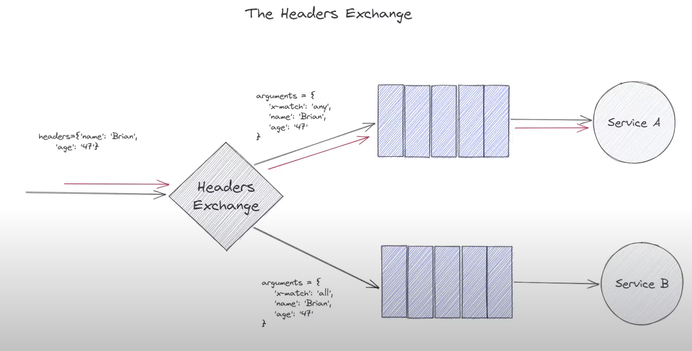

#### 8.2 代码

==producer.py==

```python
import pika
from pika.exchange_type import ExchangeType

connection_parameters = pika.ConnectionParameters('localhost')

connection = pika.BlockingConnection(connection_parameters)

channel = connection.channel()

# 选用 headers 类型的交换机
channel.exchange_declare('headersexchange', ExchangeType.headers)

message = 'This message will be sent with headers'

# 将一条包含指定消息内容和头部属性的消息发布到名为"headersexchange"的头部交换器
channel.basic_publish(exchange='headersexchange',
    routing_key='',   # 消息的路由是基于消息属性头进行匹配的，而不是路由键，所以为空字符串
    body=message,
    properties=pika.BasicProperties(headers={'name': 'brian'}) 
    # BasicProperties 用于设置消息属性的参数
    # headers 表示消息的头部属性，可以包含任何自定义的键值对
)

print(f'sent message:{message}')

connection.close()

```


==consumer.py==

```python
import pika
from pika.exchange_type import ExchangeType

def on_message_received(channel, method, properties, body):
    print(f'received new message: {body}')

connection_parameters = pika.ConnectionParameters(host='localhost', port=5672)

connection = pika.BlockingConnection(connection_parameters)

channel = connection.channel()

channel.exchange_declare('headersexchange', ExchangeType.headers)

channel.queue_declare(queue='letterbox')

# Rabbitmq 通常要求绑定参数的值（v）为字符串类型。
bind_args = {
    'x-match': 'any',  
    # 绑定条件为 any，当消息的头部属性中的任何一个条件匹配时，消息会被路由到"letterbox"队列
    # 还有一个绑定条件为 all，表示只有都满足了才会发送到相关的队列
    'name': 'brian',
    'age': '21'
}

# arguments=bind_args: 这是一个字典，包含了绑定的条件
channel.queue_bind(exchange='headersexchange', queue='letterbox', arguments=bind_args)

channel.basic_consume(queue='letterbox',auto_ack=True, on_message_callback=on_message_received)

print('Starting Consuming')

channel.start_consuming()
```


> 如果您的生产者直接将消息发送到"letterbox"队列，而不是通过交换机，那么这些消息将会直接进入"letterbox"队列，绕过了交换机和绑定条件的路由过程。因此，这些消息将不受绑定条件的影响，会立即进入队列并等待被消费者消费。
>
> 所以上面这个 consumer 不仅仅可以消费掉满足头部交换机和绑定条件来路由消息到，也可以消费掉直连到"letterbox"队列的消息。

### 9. Consistent Hashing Exchange

#### 9.1 介绍

在 RabbitMQ 中，Consistent Hashing Exchange 是一种特殊类型的交换器，它使用一致性哈希算法将消息分发到绑定在交换器上的队列上。

工作原理：

- 当使用“一致性哈希”作为交换类型的情况下，会根据消息属性（最常见的是路由关键字 routing key）计算一个 hash 值。
- 然后根据这个 hash 值，将消息分发到绑定在该交换器下的队列中。
- 因此，如果没有发生绑定更改，具有相同路由关键字的消息将具有相同哈希值并将被路由到同一队列。

<font color='orange'>队列绑定到 Consistent Hashing Exchange 时，绑定密钥（binding key）会使用一个数字字符串，表示绑定权重：这个桶的数量将与目标队列关联（范围的部分）。简单的说，就是绑定键的数字越大，那么绑定的队列的权重就越大，分发消息的时候接受到的消息就越多。</font>

如果在 RabbitMQ 中使用 Consistent Hashing Exchange，当需要动态扩展 worker 时，只需要添加新的队列并重新绑定即可，不需要对现有系统做任何其他更改。这样可以实现 RabbitMQ 的高可用性和可扩展性。

==启动插件==

使用的是 windows 系统下的 Docker Desktop 的话，那么就在页面中进入到该容器的终端，输入以下命令

```bash
# cd ./opt/rabbitmq/escript
# ls
rabbitmq-diagnostics  rabbitmq-plugins  rabbitmq-queues  rabbitmq-streams  rabbitmq-upgrade  rabbitmqctl  vmware-rabbitmq
# rabbitmq-plugins enable rabbitmq_consistent_hash_exchange
Enabling plugins on node rabbit@c735d73f0cde:
rabbitmq_consistent_hash_exchange
The following plugins have been configured:
  rabbitmq_consistent_hash_exchange
  rabbitmq_management
  rabbitmq_management_agent
  rabbitmq_prometheus
  rabbitmq_web_dispatch
Applying plugin configuration to rabbit@c735d73f0cde...
The following plugins have been enabled:
  rabbitmq_consistent_hash_exchange

started 1 plugins.
```

在查看日志的时候就可以看到

```shell
2023-09-10 19:33:52 2023-09-10 11:33:52.252220+00:00 [info] <0.27918.0> Plugins changed; enabled [rabbitmq_consistent_hash_exchange]
```

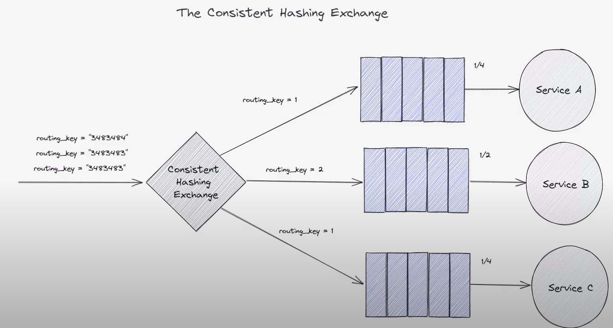

> <font color='orange'>一致性哈希算法</font>（Consistent Hashing Algorithm）是一种在分布式系统中用于数据分片和负载均衡的重要算法。它的主要原理是将数据和节点映射到一个统一的哈希环上，然后根据哈希值来确定数据应该分布到哪个节点。这种方法具有高度的扩展性，允许动态添加或删除节点而不会导致大规模数据迁移。
>
> 以下是一致性哈希算法的原理和应用：
>
> **原理：**
>
> 1. **构建哈希环**：首先，将所有的节点和数据映射到一个环形空间（哈希环）。哈希函数将每个节点和数据映射到环上的一个点。
>
> 2. **数据分片**：当需要将数据分布到节点时，将数据的哈希值计算出来，并沿着环顺时针寻找最近的节点。数据会被分配给这个节点。
>
> 3. **节点添加和删除**：如果需要添加或删除节点，只有受到影响的数据和它们的映射才会发生改变。大多数数据和节点保持不变，只有少数需要重新分配。
>
> 4. **负载均衡**：一致性哈希算法在分布数据时，尽量保持节点的负载均衡。因为数据在哈希环上均匀分布，节点负载的不平衡只会影响到相邻的节点，而不会影响整体的负载均衡。
>
> **应用：**
>
> 1. **分布式缓存**：一致性哈希算法在分布式缓存系统中用于确定缓存项应该存储在哪个缓存节点上。这样可以实现缓存数据的均匀分布，减轻缓存热点问题。
>
> 2. **分布式数据库**：在分布式数据库中，一致性哈希算法可以用于分片和负载均衡。它确保数据在不同的数据库节点上均匀分布，同时允许动态扩展或缩减节点。
>
> 3. **分布式消息队列**：一致性哈希算法可以用于分布式消息队列中，以确定消息应该发送到哪个队列或哪个消费者。这有助于确保消息按照某种顺序或条件被分发到不同的处理节点上。
>
> 4. **分布式文件系统**：在分布式文件系统中，一致性哈希算法可以用于确定文件块的存储位置，以实现数据的分布和冗余存储。
>
> 总之，一致性哈希算法在分布式系统中具有广泛的应用，可以帮助实现数据分片、负载均衡和高可用性。它的设计原则允许系统在节点的动态变化时仍然保持高效的性能，因此是分布式系统中的重要工具之一。
>
> ------------------------------------------------------------------------------------------------------------------------------------------
>
> 一致性哈希算法通过特定的哈希环数据结构以及智能的哈希键映射方式来实现节点添加和删除的拓展性和负载均衡。下面解释了一致性哈希算法如何实现这两个方面的目标：
>
> 1. **节点添加和删除的拓展性：**
>
>    - **哈希环的均匀分布：** 一致性哈希算法将节点和数据映射到一个环形空间，这个环上的哈希值范围在 0 到 2^32-1 或其他合适的范围内。这个哈希环的设计使得节点和数据在环上均匀分布，因此大多数节点和数据不会受到新节点添加或删除的影响。
>
>    - **局部改变：** 当需要添加或删除节点时，只有少量的数据和它们的映射会受到影响。新节点加入后，只需要重新映射一小部分数据，这些数据通常与新节点相邻。同样，删除节点时也只需要重新映射与被删除节点相邻的数据。这种局部改变的特性使得节点的添加和删除操作在分布式系统中更加高效。
>
>    - **虚拟节点（虚拟副本）：** 为了进一步增加哈希环上的均匀分布，一致性哈希算法通常使用虚拟节点或虚拟副本。每个物理节点在环上对应多个虚拟节点，这些虚拟节点的哈希值在环上均匀分散。这样做的好处是节点的添加或删除只会影响到虚拟节点的一小部分，而不会导致大规模的数据迁移。
>
> 2. **负载均衡：**
>
>    - **均匀分布：** 由于数据和节点在哈希环上均匀分布，这意味着每个节点负责的数据范围大致相等。因此，负载均衡是通过均匀分布实现的，不同节点的负载大致相等。
>
>    - **数据定位：** 当需要查找数据时，一致性哈希算法会计算数据的哈希值，然后沿着环顺时针查找最近的节点，将数据路由到该节点。这保证了数据的一致性路由，并且在节点负载均衡方面表现良好。
>
>    - **节点动态负载调整：** 如果某个节点的负载较高，可以通过添加更多的虚拟节点或调整节点的虚拟节点来分散负载。这种方式使得系统可以自动调整负载，确保节点的均衡性。
>
> 总的来说，一致性哈希算法通过哈希环和虚拟节点的设计，以及局部改变的特性，实现了节点添加和删除的高效性，同时通过均匀分布和数据定位来实现了负载均衡。这使得它在分布式系统中能够有效地处理大规模数据和节点的变化，同时确保数据的均匀分布和负载均衡。

#### 9.2 代码

==producer.py==

```python
import pika

connection_parameters = pika.ConnectionParameters('localhost')

connection = pika.BlockingConnection(connection_parameters)

channel = connection.channel()

# 声明了一个名为 samplehashing, 类型为 x-consistent-hash 的交换机
channel.exchange_declare(exchange='samplehashing', exchange_type='x-consistent-hash')

message = 'Hello hash the routing key and pass me on please!'

routing_key_to_hash = 'hash me'

# routing_key_to_hash 字符串进行 hash，会根据这个 hash 值来决定将这条消息发送到那条队列中
channel.basic_publish(exchange='samplehashing', routing_key=routing_key_to_hash, body=message)

print(f'sent message: {message}')

connection.close()
```

==consumer.py==

```python
import pika

def queue_1_on_message_received(channel, method, properties, body):
    print(f'queue 1 received new message: {body}')

def queue_2_on_message_received(channel, method, properties, body):
    print(f'queue 2 received new message: {body}')

connection = pika.BlockingConnection(pika.ConnectionParameters(host='localhost'))

channel = connection.channel()

channel.exchange_declare(exchange='samplehashing', exchange_type='x-consistent-hash')

channel.queue_declare(queue='queue_1')

channel.queue_declare(queue='queue_2')

# 将 queue_1 和 samplehashing 进行绑定，并设定权重为 1
channel.queue_bind(exchange='samplehashing', queue='queue_1', routing_key='1')

# 将 queue_2 和 samplehashing 进行绑定，并设定权重为 1
channel.queue_bind(exchange='samplehashing', queue='queue_2', routing_key='1')

channel.basic_consume(queue='queue_1', on_message_callback=queue_1_on_message_received, auto_ack=True)

channel.basic_consume(queue='queue_2', on_message_callback=queue_2_on_message_received, auto_ack=True)

print('Starting Consuming')

channel.start_consuming()
```

### 10. Exchange-Exchange Routing

#### 10.1 介绍

在 RabbitMQ 中，Exchange-Exchange Routing 是一种高级的消息路由模式，它允许你将一个交换机的输出路由到另一个交换机，从而实现更复杂的消息路由和过滤。

这种模式的核心思想是将一个交换机（称为源交换机）的输出绑定到另一个交换机（称为目标交换机）。当消息发送到源交换机时，它首先会经过源交换机的路由规则，然后再被路由到目标交换机。这个过程可以嵌套多层，从而实现复杂的路由逻辑。

以下是 Exchange-Exchange Routing 的关键概念和用途：

1. **源交换机（Source Exchange）**：这是消息的起点，消息首先被发送到源交换机。源交换机可以是任何类型的交换机，例如直连交换机、主题交换机、扇出交换机等。

2. **目标交换机（Target Exchange）**：这是接收从源交换机路由的消息的交换机。目标交换机也可以是任何类型的交换机，它定义了额外的路由规则，以确定消息最终被路由到哪些队列。

3. **绑定规则（Binding）**：要实现 Exchange-Exchange Routing，你需要在源交换机和目标交换机之间创建一个绑定。这个绑定定义了消息从源交换机到目标交换机的路由规则，通常涉及到路由键或其他匹配条件。

4. **多层路由**：你可以嵌套多个源交换机和目标交换机，从而形成多层的路由结构。这使得你可以实现复杂的消息路由逻辑，根据多个条件对消息进行过滤、转发或分发。

**应用场景**：

Exchange-Exchange Routing 可以用于多种复杂的消息路由场景，包括但不限于：

- **消息过滤**：将消息从源交换机路由到目标交换机，并根据不同的条件将消息筛选到不同的队列，从而实现消息的过滤。

- **多级路由**：创建多层交换机，根据不同的路由规则将消息从一个级别的交换机传递到下一个级别，以便进行更复杂的消息处理。

- **消息聚合**：将多个源交换机的消息路由到一个目标交换机，以便对它们进行聚合处理或汇总。

- **路由规则调整**：根据需要动态调整消息的路由规则，而不需要改变生产者和消费者之间的通信。

Exchange-Exchange Routing 提供了一种灵活而强大的消息路由机制，可以根据不同的业务需求创建复杂的消息处理流程，同时保持了系统的可维护性和可扩展性。

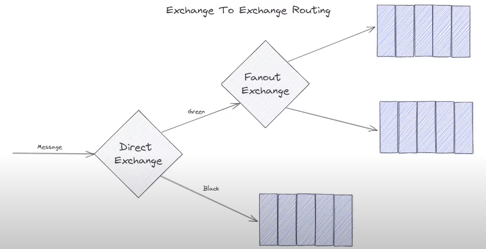

#### 10.2 代码

==producer.py==

```python
import pika

connection_parameters = pika.ConnectionParameters(host='localhost', port=5672)

connection = pika.BlockingConnection(connection_parameters)

channel = connection.channel()

# 声明一个名为 'firstexchange' 的直连交换机，并指定交换机类型为 'direct'
channel.exchange_declare(exchange='firstexchange', exchange_type='direct')

# 声明一个名为 'secondexchange' 的扇出交换机，并指定交换机类型为 'fanout'
channel.exchange_declare(exchange='secondexchange', exchange_type='fanout')

# 将 'secondexchange' 扇出交换机绑定到 'firstexchange' 直连交换机上
channel.exchange_bind(destination='secondexchange', source='firstexchange')

message = "This message has gone through multiple exchanges"

# 使用 'firstexchange' 直连交换机发送消息，路由键为空
channel.basic_publish(exchange='firstexchange', routing_key='', body=message)

print(f"sent message: {message}")

connection.close()

```


==consumer.py==

```python
import pika

def on_message_received(channel, method, properties, body):
    print(f'received new message: {body}')

connection_parameters = pika.ConnectionParameters(host='localhost')

connection = pika.BlockingConnection(connection_parameters)

channel = connection.channel()

channel.exchange_declare(exchange='secondexchange', exchange_type='fanout')

channel.queue_declare(queue='letterbox')

channel.queue_bind(exchange='secondexchange', queue='letterbox')

channel.basic_consume(queue='letterbox', on_message_received=on_message_received,
                       auto_ack=True)

print('Starting Consuming')

channel.start_consuming()
```

 将 'secondexchange' 扇出交换机绑定到 'firstexchange' 直连交换机上，这样我们给第一个交换机发消息，和第二个交换机绑定的队列也可以得到对应的消息。

### 11. Request-Reply Pattern

#### 11.1 介绍

RabbitMQ中的"Request-Reply"模式是一种常见的消息通信模式，用于在分布式系统中实现请求和响应之间的通信。这种模式通常涉及两个角色：发送请求的客户端和处理请求并返回响应的服务器。

以下是"Request-Reply"模式的基本工作原理：

1. **客户端发送请求**：客户端（发送方）向服务器发送一个请求消息，请求可以包含特定的任务或操作。通常，客户端会创建一个唯一的回调队列（Callback Queue）用于接收响应。

2. **服务器处理请求**：服务器（接收方）监听一个用于接收请求的队列，当服务器收到请求后，会处理请求并执行相应的操作。然后，服务器将响应消息发送回客户端，通常将响应消息发送到客户端指定的回调队列中。

3. **客户端接收响应**：客户端监听其回调队列，等待来自服务器的响应。一旦客户端收到响应消息，它可以从中提取所需的信息或结果。

4. **服务器清理资源**：在完成响应后，服务器通常会删除与该请求相关的任何临时资源，并将响应发送给客户端。

"Request-Reply"模式的优点包括：

- 异步通信：客户端和服务器之间的通信是异步的，可以提高系统的响应性能。
- 解耦合：客户端和服务器之间的通信通过消息队列进行，可以实现解耦合，允许各个组件独立运行。
- 高可扩展性：您可以轻松地添加更多的客户端和服务器，以满足系统的需求。

要在RabbitMQ中实现"Request-Reply"模式，您需要合理使用消息队列、交换器、队列和消息属性，以确保请求和响应的匹配。通常，回调队列用于关联请求和响应，而消息属性（例如，correlation_id）用于标识响应与哪个请求相关联。

这种模式在分布式系统、微服务架构和异步通信中非常常见，可用于处理各种类型的任务和操作请求。

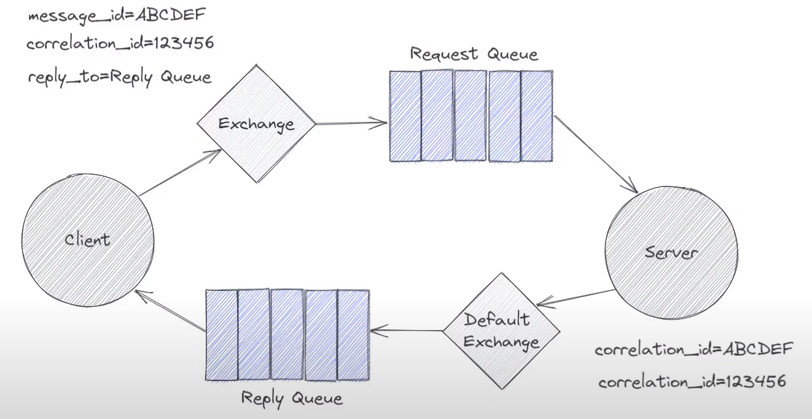

#### 11.2 代码

代码的实现关键在于消息属性的设置。

==server.py==  就只有一个队列，先消费掉请求信息，再在回调中发送回复信息

```python
import pika

# 回调函数中服务器打印请求消息的相关信息，发送响应消息到指定的回复队列
def on_request_message_received(ch, method, properties, body):
    print(f"Received Request: {properties.correlation_id}")
    ch.basic_publish('', routing_key=properties.reply_to,
                    body=f'Hey its your reply to {properties.correlation_id}')

connection = pika.BlockingConnection(pika.ConnectionParameters('localhost'))

channel = connection.channel()

channel.queue_declare(queue='request-queue')

# 设置了一个消费者监听 "request-queue" 队列。当有请求消息到达队列时，执行回调函数
channel.basic_consume(queue='request-queue', auto_ack=True,
                    on_message_callback=on_request_message_received)

print("Starting Server")

channel.start_consuming()

```

**server.py（服务端）**：

1. 首先，它建立与RabbitMQ服务器的连接，并创建一个通道（channel）。
2. 使用`channel.queue_declare(queue='request-queue')`声明一个名为"request-queue"的队列，用于接收客户端的请求消息。
3. 使用`channel.basic_consume()`方法设置一个消费者，监听"request-queue"队列。当有请求消息到达队列时，执行`on_request_message_received`回调函数。
4. 在`on_request_message_received`回调函数中，服务器打印收到的请求消息的相关信息，并使用`ch.basic_publish()`方法发送响应消息到指定的回复队列（`reply_to`属性指定的队列）。
5. 通过`channel.start_consuming()`启动消费者，使其一直运行，等待来自客户端的请求。


==client.py==  有两个队列，一个请求一个接收

```python
import pika
import uuid

def on_reply_message_received(channel, method, properties, body):
    print(f"reply recieved: {body}")

connection = pika.BlockingConnection(pika.ConnectionParameters(host='localhost'))

channel = connection.channel()

# 声明一个队列，用于接收回复消息
reply_queue = channel.queue_declare(queue='', exclusive=True)  # 自动给队列分配个名字

# 接收回复
channel.basic_consume(queue=reply_queue.method.queue, auto_ack=True, 
                    on_message_callback=on_reply_message_received)

# 声明一个队列，用于发送请求消息
channel.queue_declare(queue='request-queue')

# 作为请求的唯一标识符，以便在接收响应时能够将其与请求关联起来
cor_id = str(uuid.uuid4())
print(f"Sending Request: {cor_id}")

# 用于设置消息的属性
# reply_to 指定了客户端期望接收响应的队列  correlation_id 用于标识请求和相应之间的关联关系
props = pika.BasicProperties(reply_to=reply_queue.method.queue, correlation_id=cor_id)

# 发送响应
channel.basic_publish(exchange='', routing_key='request-queue', properties=props,
                    body='Can I request a reply?')

print("Starting Client")

channel.start_consuming()

```

**client.py（客户端）**：

1. 客户端也建立与RabbitMQ服务器的连接，并创建一个通道。
2. 使用`channel.queue_declare(queue='request-queue')`声明一个名为"request-queue"的队列，这个队列用于发送请求消息。
3. 创建一个唯一的`cor_id`，作为请求的唯一标识符，以便在接收响应时能够将其与请求关联起来。
4. 使用`pika.BasicProperties`创建消息属性，设置`reply_to`为一个临时队列，并设置`correlation_id`为前面生成的`cor_id`。
5. 使用`channel.basic_publish()`方法将包含请求信息和属性的消息发送到"request-queue"队列，向服务器发送请求。
6. 使用`channel.basic_consume()`方法设置一个消费者，监听临时队列（用于接收响应消息）。当有响应消息到达队列时，执行`on_reply_message_received`回调函数。
7. 在`on_reply_message_received`回调函数中，客户端打印收到的响应消息。
8. 最后，通过`channel.start_consuming()`启动消费者，使其一直运行，等待来自服务器的响应。


总之，这两个代码示例展示了一个基本的RabbitMQ请求-响应通信模式，其中客户端发送请求消息到服务器，服务器接收请求并发送响应消息给客户端。这种模式可用于实现分布式系统中的远程调用或RPC（Remote Procedure Call）。


### 12. Alternate Exchange

#### 12.1 介绍

Alternate Exchange（备用交换机）是RabbitMQ中的一种机制，用于处理无法被其他交换机路由的消息。它为消息提供了一个备用的处理路径，以防无法将消息路由到其目标队列。

以下是 Alternate Exchange 的主要特点和用途：

1. **备用路由**：当消息无法被主要交换机路由到任何队列时，它们会被发送到备用交换机，从而提供了备用的消息路由路径。

2. **配置方式**：要使用备用交换机，需要在声明主要交换机时，通过设置 `arguments` 参数将备用交换机的名称指定为备用。这告诉 RabbitMQ 在无法路由消息时将其发送到备用交换机。

3. **处理无法路由的消息**：备用交换机通常与备用队列相关联。如果消息无法路由到主要交换机，则它们被发送到备用交换机，然后通过备用交换机路由到备用队列。消息可以在备用队列中进行进一步处理，例如记录、重试、丢弃或发送通知。

4. **灵活性和错误处理**：备用交换机提供了一种处理消息路由失败的机制。这对于处理消息的灵活性和错误恢复非常有用。例如，在某些情况下，您可能希望将无法路由的消息存储在备用队列中，以后再进行手动处理。

5. **降低消息丢失的风险**：通过使用备用交换机，可以减少因消息路由失败而丢失消息的风险。这可以确保即使消息无法被主要交换机正确路由，它们仍然可以被处理或记录下来，以后进行检查。

总之，备用交换机是一种在消息路由失败时提供备用处理路径的重要机制，它增强了消息的可靠性和灵活性，并有助于改善消息处理和错误恢复的策略。

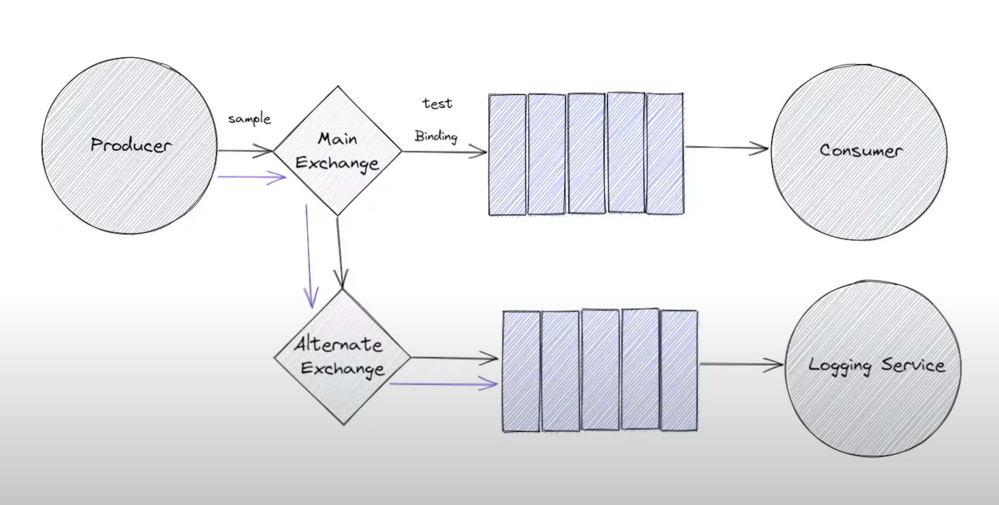

#### 12.2 代码

==producer.py==

```python
import pika
from pika.exchange_type import ExchangeType

connection = pika.BlockingConnection(pika.ConnectionParameters(host='localhost'))

channel = connection.channel()

channel.exchange_declare(exchange='altexchange', exchange_type=ExchangeType.fanout)

channel.exchange_declare(exchange='mainexchange', exchange_type=ExchangeType.direct,
                        arguments={'alternate-exchange': 'altexchange'})

message = 'Hello this is my first message'

# mainexchange 没有绑定过 test 这个路由键的队列，所以没有队列可以接收来自 mainexchange 的消息
channel.basic_publish(exchange='mainexchange', routing_key='test', body=message)

print(f"sent message:{message}")

connection.close()
```


==consumer.py==

```python
import pika
from pika.exchange_type import ExchangeType

def alt_queue_on_received(ch, method, properties, body):
    print(f'Alt - received new message: {body}')

def main_queue_on_received(ch, method, properties, body):
    print(f'Main - received new message: {body}')

connection = pika.BlockingConnection(pika.ConnectionParameters(host='localhost'))

channel = connection.channel()

channel.exchange_declare(exchange='altexchange', exchange_type=ExchangeType.fanout)

channel.exchange_declare(exchange='mainexchange', exchange_type=ExchangeType.direct, 
                        arguments={'alternate-exchange': 'altexchange'})

channel.queue_declare(queue='alt_queue')
channel.queue_bind(exchange='altexchange', queue='alt_queue')

channel.basic_consume(queue='alt_queue', on_message_callback=alt_queue_on_received)

channel.queue_declare(queue='main_queue')
channel.queue_bind(exchange='mainexchange', queue='main_queue')

channel.basic_consume(queue='main_queue', on_message_callback=main_queue_on_received)

print('Starting Consuming')

channel.start_consuming()
```

这两个文件一起展示了备用交换机的使用示例，其中生产者发送消息到主交换机，而消费者根据消息路由将消息接收到备用交换机或主交换机，并通过不同的回调函数来处理这些消息。备用交换机用于处理无法路由到主交换机的消息。

在上面的代码中，主交换机 `mainexchange` 不会读取到消息。消息将被发送到备用交换机 `altexchange`，因为在声明 `mainexchange` 交换机时，通过设置 `arguments` 参数，将备用交换机指定为 `altexchange`。这意味着如果消息无法路由到 `mainexchange`，它将被发送到备用交换机 `altexchange`。

### 13. DeadLetter Exchange

#### 13.1 介绍

Dead Letter Exchange（死信交换机）是RabbitMQ中的一种机制，用于处理那些由于某些原因而无法被消费或路由到目标队列的消息。Dead Letter Exchange提供了一种将这些消息从原始队列传递到备用队列的方式，以便稍后进行处理、分析或调查。

以下是 Dead Letter Exchange 的主要特点和用途：

1. **处理无法消费的消息**：Dead Letter Exchange通常与队列相关联，用于处理那些无法被消费者成功处理的消息，例如消费者抛出异常或无法处理消息的情况。

2. **超时和重试**：您可以使用Dead Letter Exchange来处理消息的超时情况。如果消息在指定的时间内未被消费，它可以被发送到死信交换机，然后重新排队以进行重试或进一步处理。

3. **错误处理**：Dead Letter Exchange允许您将无法处理的消息发送到备用队列，以便稍后进行错误处理、调查或分析。这有助于识别和解决消息处理中的问题。

4. **延迟队列**：Dead Letter Exchange还可以用于实现延迟队列的机制。您可以将消息发送到一个队列，然后设置Dead Letter Exchange将消息转发到另一个队列，以实现消息的延迟处理。

5. **配置方式**：要使用Dead Letter Exchange，您需要在声明队列时指定死信交换机以及可选的死信路由键。当消息满足某些条件（例如超时或无法路由）时，它们将被发送到死信交换机，并通过死信路由键路由到备用队列。

6. **监控和诊断**：Dead Letter Exchange可以帮助您监控和诊断消息处理问题。通过将无法处理的消息发送到备用队列，您可以在稍后对这些消息进行审查，并采取适当的措施。

总之，Dead Letter Exchange是一种处理无法被消费或路由的消息的有用机制，它提供了一种灵活的方式来处理消息处理中的问题，支持错误处理、重试、超时和延迟队列等应用场景。

> Dead Letter Exchange（死信交换机）和 Alternate Exchange（备用交换机）是RabbitMQ中两种不同的消息处理机制，它们的主要区别在于用途和处理方式：
>
> 1. **用途**：
>    - **Dead Letter Exchange（死信交换机）**：用于处理那些由于某些原因而无法被消费或路由到目标队列的消息。通常用于处理消息的错误、超时、重试等情况。
>    - **Alternate Exchange（备用交换机）**：用于处理无法被其他交换机路由的消息。主要用于消息路由失败的情况。
>
> 2. **触发条件**：
>    - **Dead Letter Exchange**：消息成为死信的条件可以是多种情况，包括消息被拒绝、消息超时、队列达到最大长度等。
>    - **Alternate Exchange**：消息成为备用交换机的条件是无法被主要交换机正确路由到队列。
>
> 3. **处理方式**：
>    - **Dead Letter Exchange**：死信消息通常被重新排队以进行重试或进一步处理，或者被发送到特定的死信队列，以供稍后进行调查和分析。
>    - **Alternate Exchange**：备用交换机将无法路由的消息直接转发到备用队列，绕过了主要交换机的路由逻辑。
>
> 4. **配置方式**：
>    - **Dead Letter Exchange**：需要在队列声明时设置相关的死信参数，包括死信交换机和死信路由键。
>    - **Alternate Exchange**：需要在声明主要交换机时，通过设置交换机的 `arguments` 参数，将备用交换机指定为备用。
>
> 5. **应用场景**：
>    - **Dead Letter Exchange**：适用于处理消息的错误、超时、重试等情况，用于实现错误处理、延迟队列等功能。
>    - **Alternate Exchange**：适用于处理消息路由失败的情况，用于确保消息不会丢失，并提供备用路由路径。
>
> 总之，Dead Letter Exchange和Alternate Exchange是两种不同的消息处理机制，用于处理不同的消息处理情况。Dead Letter Exchange主要用于处理消息的错误和超时情况，而Alternate Exchange主要用于处理消息路由失败的情况，提供备用路由路径。选择使用哪种机制取决于您的特定需求和应用场景。


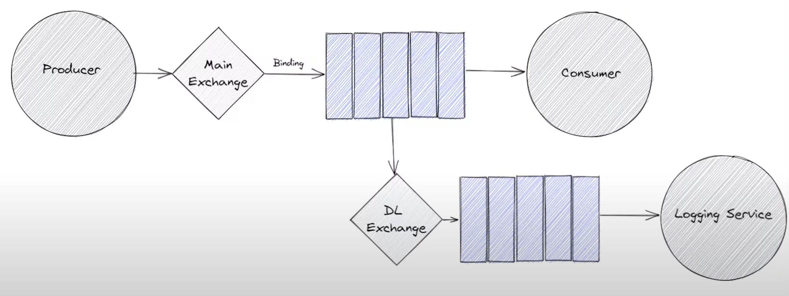

#### 13.2 代码

==producer.py==

```python
import pika
from pika.exchange_type import ExchangeType

connection = pika.BlockingConnection(pika.ConnectionParameters("localhost"))

channel = connection.channel()

channel.exchange_declare(exchange="mainexchange", exchange_type=ExchangeType.direct)

message = 'This message might expire'

channel.basic_publish(exchange="mainexchange", routing_key="test", body=message)

print(f'send message:{message}')

connection.close()
```


==consumer.py==

```python
import pika
from pika.exchange_type import ExchangeType

def deadletter_queue_on_message_received(ch, method, properties, body):
    print(f'Dead letter - received new message: {body}')
    ch.basic_ack(method.delivery_tag)

def main_queue_on_message_received(ch, method, properties, body):
    print(f'Main - received new message: {body}')

connection_parameters = pika.ConnectionParameters('localhost')

connection = pika.BlockingConnection(connection_parameters)

channel = connection.channel()

channel.exchange_declare(exchange='mainexchange', exchange_type=ExchangeType.direct)

channel.exchange_declare(exchange='dlx', exchange_type=ExchangeType.fanout)

channel.queue_declare(
    queue='mainexchangequeue', 
    arguments={'x-dead-letter-exchange': 'dlx',  'x-message-ttl': 1000})
channel.queue_bind('mainexchangequeue', 'mainexchange', 'test')

channel.queue_declare('deadletterqueue')
channel.queue_bind('deadletterqueue', 'dlx')
channel.basic_consume(queue='deadletterqueue', on_message_callback=deadletter_queue_on_message_received)

print('Starting Consuming')

channel.start_consuming()
```


此消费者的作用是监听 "mainexchangequeue" 队列，该队列具有消息过期时间和死信交换机配置。如果消息在队列中过期或无法路由到 "main_exchange"，它们将成为死信并被路由到 "dlx" 交换机，然后被 "deadletter_queue_on_message_received" 函数处理。


### 14. Accept-Reject-Message

#### 14.1 介绍

在消费者，对于消息，我们除了接收，还可以进行拒绝。

#### 14.2 代码

==producer.py==

```python
import pika
from pika.exchange_type import ExchangeType

connection = pika.BlockingConnection(pika.ConnectionParameters(host='localhost'))

channel = connection.channel()

channel.exchange_declare(exchange='accept_reject_exchange', exchange_type=ExchangeType.fanout)

message = 'Lets send this'

while True:
    channel.basic_publish(exchange='accept_reject_exchange', routing_key='', body=message)
    print("Sent message: {}".format(message))
    input('Press any key to continue')

```


==consumer.py==

```python
import pika
from pika.exchange_type import ExchangeType

# 当接收到消息时触发的回调函数
def on_message_received(ch, method, properties, body):
    
    if (method.delivery_tag % 5 == 0):
        #  ch.basic_ack(delivery_tag=method.delivery_tag, multiple=True)

        # 拒绝消息（不重新入队），并确认多个消息 可以一次性拒绝多个消息
         ch.basic_nack(delivery_tag=method.delivery_tag, requeue=False, multiple=True)
        # requeue 参数为 True，则拒绝的消息将被重新放入队列中，等待后续再次投递 只能处理单个消息 
        # ch.basic_reject(delivery_tag=method.delivery_tag, requeue=True)
    else:
        print(f'Received new message: {method.delivery_tag}')

connection = pika.BlockingConnection(pika.ConnectionParameters(host='localhost'))

channel = connection.channel()

channel.exchange_declare(exchange='accept_reject_exchange', exchange_type=ExchangeType.fanout)

channel.queue_declare(queue='letterbox')
channel.queue_bind('letterbox', 'accept_reject_exchange')

channel.basic_consume(queue='letterbox', on_message_callback=on_message_received)

print('Starting Consuming')

channel.start_consuming()

```

### 15. properties

```python
def __init__(self, content_type=None, content_encoding=None, headers=None, delivery_mode=None, priority=None, correlation_id=None, reply_to=None, expiration=None, message_id=None, timestamp=None, type=None, user_id=None, app_id=None, cluster_id=None):
        self.content_type = content_type
        self.content_encoding = content_encoding
        self.headers = headers
        if isinstance(delivery_mode, DeliveryMode):
            self.delivery_mode = delivery_mode.value
        else:
            self.delivery_mode = delivery_mode
        self.priority = priority
        self.correlation_id = correlation_id
        self.reply_to = reply_to
        self.expiration = expiration
        self.message_id = message_id
        self.timestamp = timestamp
        self.type = type
        self.user_id = user_id
        self.app_id = app_id
        self.cluster_id = cluster_id
```


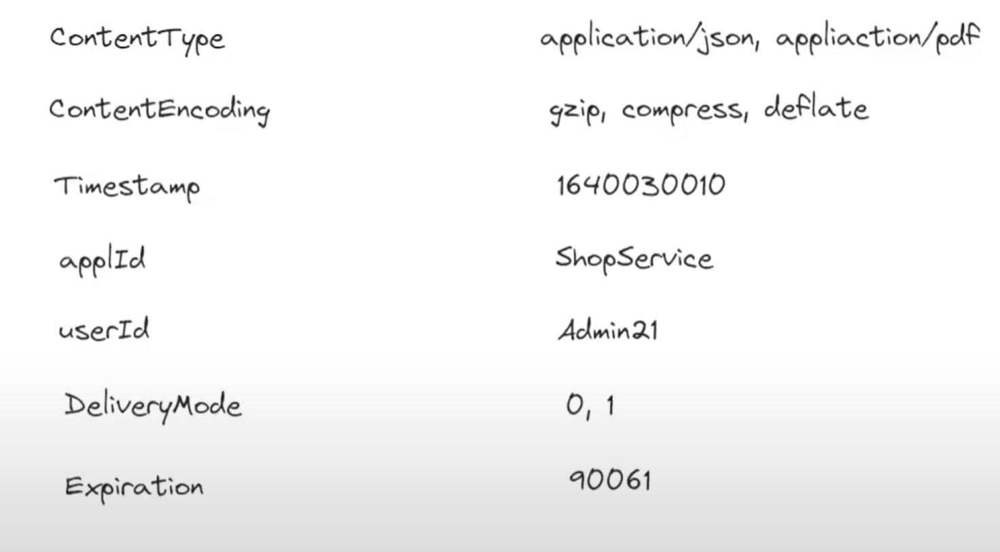